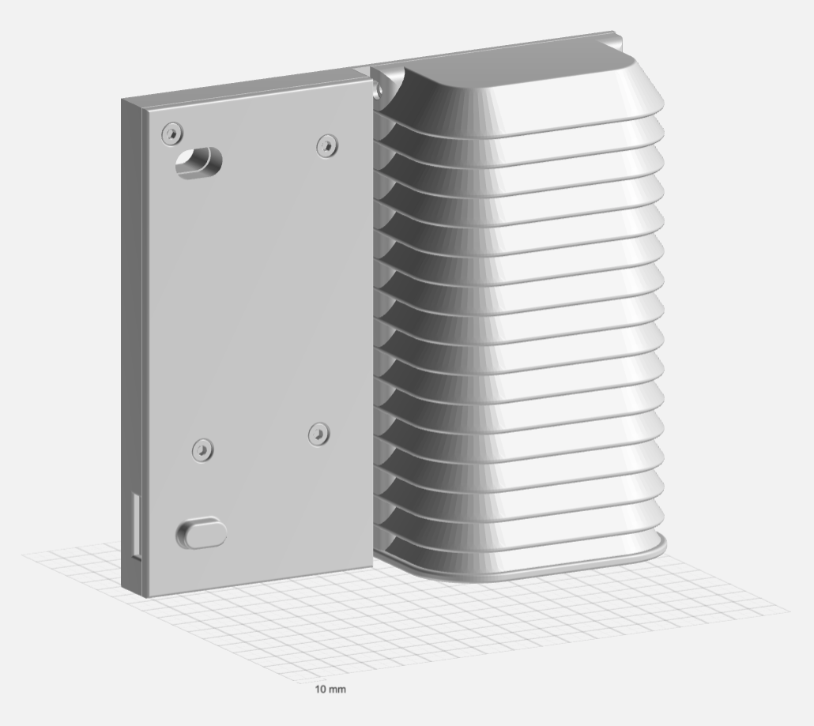
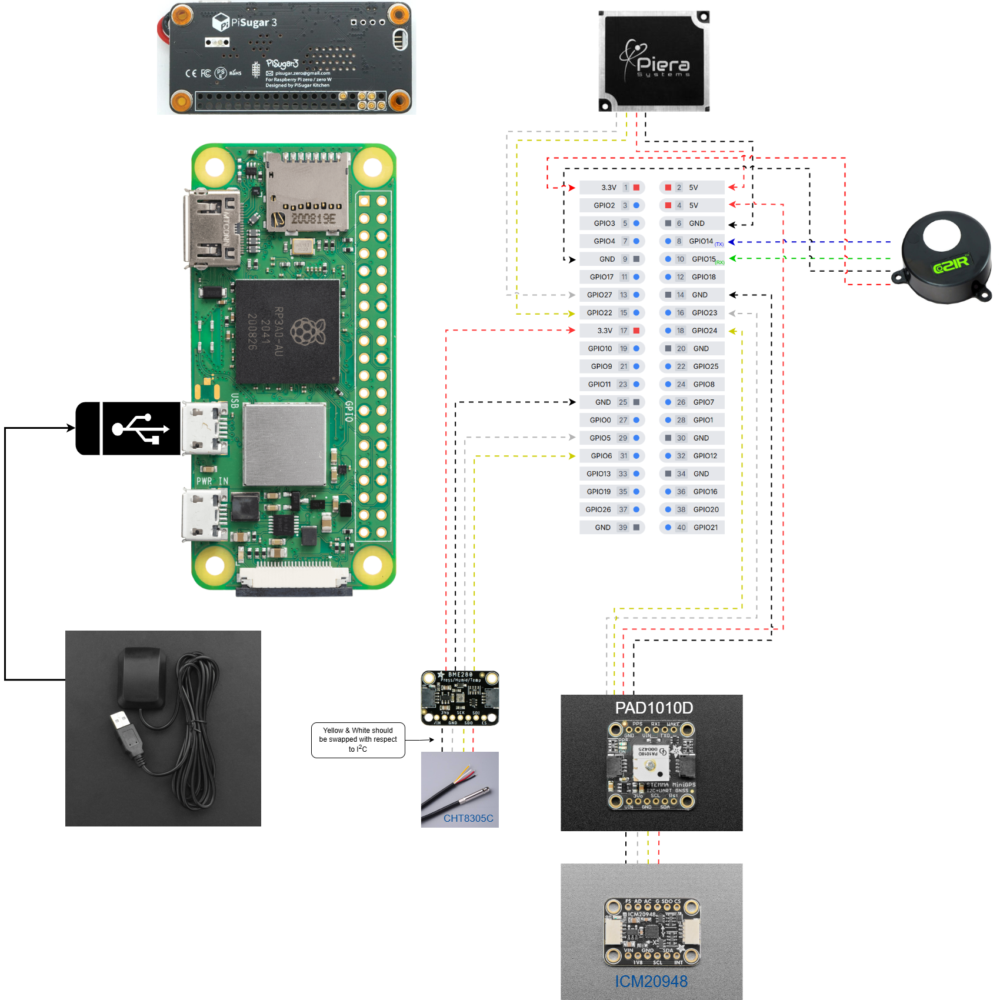

# MASK – Mints Automobile Sensing Kit

The **MASK** is a compact, vehicle-mounted sensing system designed to be installed on the rear license plate. It enables real-time environmental monitoring by collecting data on:

- Particulate Matter (PM)  
- Carbon Dioxide (CO₂)  
- Temperature  
- Humidity  
- Atmospheric Pressure

---

## Wiring Diagram

The wiring layout for the MASK system is illustrated below:

